# iOS project template

<p align="center">
  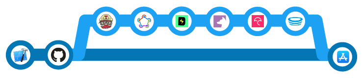
</p>

This repository contains a template for iOS projects with a framework-oriented architecture approach, preconfigured [fastlane](https://fastlane.tools) lanes, [Travis CI](https://travis-ci.com) jobs and Github integrations of [Codecov](https://codecov.io), [HoundCI](https://houndci.com) for [SwiftLint](https://github.com/realm/SwiftLint) and [Danger](https://danger.systems/ruby). It provides a starting point for new projects which can be immediately distributed via HockeyApp and Testflight.

This template has three goals:

* It can easily be configured.
* It will contain all the necessary files to build and distribute the app.
* The different parts work independently. 

[](https://travis-ci.org/messeb/ios-project-template)

#### Contact

<a href="https://to.messeb.com/twitter"></a> <br>
Follow me on Twitter: [@_messeb](https://to.messeb.com/twitter) 

<a href="https://to.messeb.com/contact"></a> <br>
Contact me on LinkedIn: [@messingfeld](https://to.messeb.com/contact)

---
#### Table of Contents

* [Introduction](#introduction)
* [Xcode Project](#xcode-project)
  * [Project structure](#project-structure)
  * [Configurations (*.xcconfig files)](#configurations-xcconfig-files)
  * [Project frameworks](#project-frameworks)
* [Build & sign the app](#build--sign-the-app)
  * [Used fastlane features](#used-fastlane-features)
  * [Code signing with fastlane](#code-signing-with-fastlane)
  * [Fastlane lanes](#fastlane-lanes)
* [Build Server](#build-server)
  * [Travis CI](#travis-ci)
  * [Environment variables](#environment-variables)
* [Distribution](#distribution)
  * [HockeyApp](#hockeyapp)
  * [Testflight & App Store](#testflight--app-store)
* [GitHub Integrations](#github-integrations)
  * [Danger](#danger)
  * [HoundCI](#houndci)
  * [Codecov](#codecov)
* [Usage](#usage)
---

## Introduction

To set up new iOS projects with a ci/cd pipeline is always a little mess. Everyone gives input, but usually, someone of the team members has to care about all the following steps:

* Setup a build server or build service.
* Manage the internal distribution of the app to the product owner and testers.
* Providing the signing certificates and provisioning profiles.
* Configure signing for different release stages.
* Creating ci/cd pipelines for pull request and distribution.
* Add code quality definitions for pull requests, like linting and test coverage rules.

The repository contains an example solutions for all of the points. For every step, it includes one solution.

## Xcode Project

The iOS template consists of an Xcode workspace file ([iOSProject.xcworkspace](./iOSProject.xcworkspace)) with the project for the app ([iOSProject.xcodeproj](./iOSProject.xcodeproj)) and a framework project ([Core.xcodeproj](./Core/Core.xcodeproj)), named _Core_. The structure is:

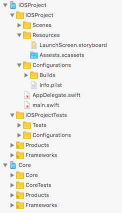

### Project structure

The app project is separated into three main folders: _Scenes_, _Resources_, and _Configurations_. It's only an alternative structure to the default Xcode project.

**Scenes**: Should be the folder, where the different scenes or modules of the app are placed. The concrete structure depends on the chosen app architecture.

**Resources**: Contains all assets for the app, like the launch screen or the image assets.

**Configurations**: Contains all the files which define the build artifacts of the app. It contains the [Info.plist](./iOSProject/Configurations/Info.plist) and a [Builds](./iOSProject/Configurations/Builds) folder with _*.xcconfig_ files for the different build configurations.

The root folder of the project also includes the [AppDelegate.swift](./iOSProject/AppDelegate.swift) and the [main.swift](./iOSProject/main.swift) files. 

**AppDelegate.swift**: In the AppDelegate the main `UIWindow` instance of the app is created, and an empty `UIViewController` instance is assigned as the root view controller. Modern app architectures, like _MVVM_ or _VIPER_, work better with manual creation of the entry point, than using the `Main Interface` possibility. Therefore the `Main.storyboard` file was deleted and the `Main Interface` reference from the project removed:

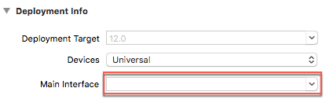

**main.swift**: In a default iOS project, the `AppDelegate` class is annotated with [@UIApplicationMain](https://docs.swift.org/swift-book/ReferenceManual/Attributes.html) (scroll down to _UIApplicationMain_). It replaces the `main` function of the project and the manual call of [UIApplicationMain(_:_:_:_:)](https://developer.apple.com/documentation/uikit/1622933-uiapplicationmain). To reenable the possibility to call it manual, the annotation has to be removed, and you have to create a [main.swift](./iOSProject/main.swift) file. With a [main.swift](./iOSProject/main.swift) file, it's possible to customize the parameter for the [UIApplicationDelegate](https://developer.apple.com/documentation/uikit/uiapplicationdelegate). You can set an empty instance for unit tests to prevent side effects of parallel code execution in the test host.

#### Configurations (\*.xcconfig files)

The whole project configurations are moved from the project file to _*.xcconfig_ files in the [`iOSProject/Configurations/Builds`](./iOSProject/Configurations/Builds) folder.
The usage of _*.xcconfig_ files in a project solves two problems:

* Separation of project configuration and file references in the project. Now, only changes of files and folders are made in the project file. Changes of configurations in the project file should always be rejected. This prevents mistaken changes during development.
* Traceability which changes are done in the project configuration during development. The history of changes in a decides _*.xcconfig_ file can be more straightforward analyze, than in a complex project file with additional modifications.

You see in the project build settings that all the configurations are moved from the project to config files. Enable _All_ and _Levels_:

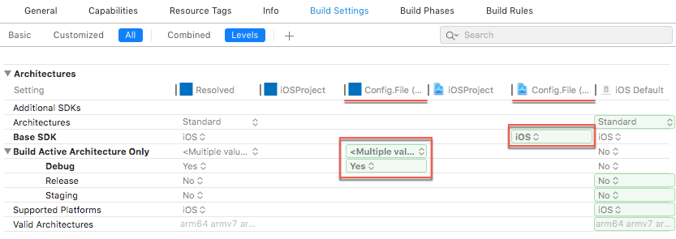

The configurations are also split in different files:

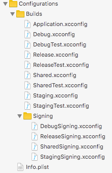

**Application.xcconfig**: Contains all configurations which were in the _Project_ section of the build settings. These values are set for all of the targets of the project, _iOSProject_ and _iOSProjectTests_.

**Debug.xcconfig**, **Staging.xcconfig**, **Release.xcconfig**: Contains the different configuration values for the various app builds variants of the _iOSProject_ target. The target has configured for three app builds, for varying stages and with different bundle identifiers. Same configuration values are extracted to **Shared.xcconfig**. For the test target exists the equivalent **\*Test.xcconfig** files.

**DebugSigning.xcconfig**, **StagingSigning.xcconfig**, **ReleaseSigning.xcconfig**: Contains the configurations for creating the different build artifacts of the _iOSProject_ target. Like the bundle identifiers or if you want _Manual Code Signing_.

#### Target configurations

The _*.xcconfig_ files can assign to project configurations:

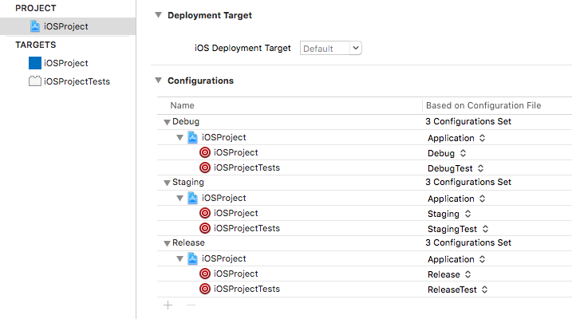

With the different configurations, _Debug_, _Staging_ and _Release_, you can produce different app artifacts. The app artifacts can distinguish by bundle identifier, display name and signing, because if the different _*.xcconfig_ files.

**Debug**: Can be used for development. It has an own bundle identifier, the code signing is set to _Automatically_, and the _Team_ could be set to an (enterprise) developer team account, to which all the developers belong. So, Xcode manages the code signing, and every developer can test the app directly on a real device.

**Staging**: Can be used for In-House-Testing. With an own bundle identifier and signing information, it can be distributed via an external service, like HockeyApp. If you sign your staging app artifacts for an enterprise release, every member of your company or your client could test the app without submitting to Testflight.

**Release**: Should produce the app artifacts for the Testflight beta test and the App Store release. It also has it's own bundle identifier and signing configuration. 

The whole management of the different app artifacts is done inside the Xcode project, because this maintains the independence from third-party configurations steps, like in [fastlane](https://fastlane.tools/). Switching between different build methods is straightforward. You can build and export the app artifacts via Xcode or use `xcodebuild` on the command line, or yet use [fastlane](https://fastlane.tools/). With the extracted signing configurations in the _*.Signing.xcconfig_ files, it's also simple to modify the different app artifacts settings. 

### Project frameworks

The project workspace also contains a `Core` framework. It's a sample integration of a custom framework mainly for separate different code parts in different modules.
Dedicated frameworks for different logical components in the app have some advantages:

* The separated code in frameworks makes it easier to manage the whole code basis. If you have additional targets, like for a Today Extension, you only need to import the relevant modules in it and keep the target artifacts smaller. And you don't have to hassle with the _Target Membership_ of the source code files. Keep in mind to enable the _App Extension_ option _Allow app extension API only_ in the project settings of the frameworks to prevent using unsupported features for extensions.
* Because only public members of classes in frameworks are accessible from outside, you usually care more about the public interface. That's a small part of creating cleaner code, but it helps you a lot if you can improve the implementation of features over time and don't have to worry that someone uses modules in an not intended way.
* The frameworks are separated projects of the project workspace and have an own project file. If you add files to the framework, these only effects the framework project file. That makes commits and merges much more comfortable, than handling the whole file references in one project file.
* Framework projects in one workspace make Swift code migration easier to handle, because you migrate your whole project in one step, and not each framework for its own.
* The usage of frameworks affects the build time positive during development, too. Frameworks will only rebuild if you made changes in it.

#### Project frameworks vs. Carthage / Cocoapods

An alternative to the framework projects in the workspace, you could use _Carthage_ or _Cocoapods_ to build submodules for the project and include them into it. But I decide against that solution, because:

* The development with frameworks in a workspace is much faster and direct than via a dependency management system. You can develop in the same Xcode window, and changes in the framework will directly affect the other parts of the code base. You don't have to run an additional step or change paths for development.
* The frameworks are dedicated to using these at first only in this one app. You don't need some extra release step or specific versioning. Changes in one framework are changes in the app. Of course, the framework could extract later in an own _Carthage_ / _Cocoapods_ project, if it grows to an own project - and then you will lose your git history. 

#### Integration in project

To integrate a framework in your app project, just add it to the **Embedded Binaries** section of your project target:


### Third-party dependencies

The project template uses [Carthage](https://github.com/Carthage/Carthage) as dependency manager. Just follow the instructions in the [Adding frameworks to an application](https://github.com/Carthage/Carthage#adding-frameworks-to-an-application) to use the dependencies in your app.

If you want to use the Carthage dependencies in one of the project frameworks, you have to add the frameworks also in the app target ([Adding frameworks to an application](https://github.com/Carthage/Carthage#adding-frameworks-to-an-application)). Also, you have to link the Carthage frameworks to your framework:

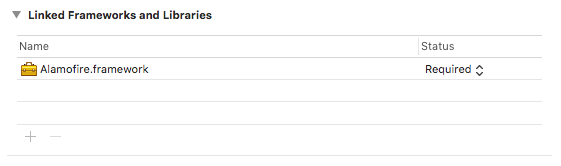


Also, you have to add the Carthage folder (relative path from framework: `$(PROJECT_DIR)/../Carthage/Build/iOS`) to the environment variables `LD_RUNPATH_SEARCH_PATHS` and `FRAMEWORK_SEARCH_PATHS`. Have a look at the [Shared.xcconfig](Core/Core/Configurations/Builds/Shared.xcconfig) file of the framework.

## Build & sign the app

To build and sign an app artifact the template uses [fastlane](https://www.fastlane.tools). Fastlane provides an extensive collection of Ruby scripts to support the daily routines of iOS developer. The most used functionality is probably the abstraction for the command line tool `xcodebuild` with the Ruby functions [`run_tests`](https://docs.fastlane.tools/actions/run_tests/) and [`build_ios_app`](https://docs.fastlane.tools/actions/build_ios_app/). Fastlane also delivers fast and regular updates for changes of the abstracted functionality. Perhaps you don't even recognize that the command line arguments of `xcodebuild` changed over time if you kept fastlane up to date. The abstraction and the proper maintenance are only two strengths of fastlane which makes it worth to use it.

### Used fastlane features

The project template divides responsibilities for the build and distribution process to the Xcode project and the fastlane scripts. 

The variant configuration of the different build artifacts is done via the _Debug_, _Staging_ and _Release_ configuration in the Xcode project. Also, the used signing settings are configured in the different `*.xcconfig` files. These configurations could also be done via fastlane using functions like [update\_app\_identifier](https://docs.fastlane.tools/actions/update_app_identifier/) or the use the [Appfile](https://docs.fastlane.tools/advanced/Appfile/). But if you do that configuration with fastlane, you always need it. With the base configuration already defined in the project, you could build your variants directly with Xcode - if you have installed the signing certificate and the mobile provisioning profile.

To build the different app configuration on a build server fastlane is used. Fastlane is also responsible for the creation of the signing environment and the distribution via [HockeyApp](https://www.hockeyapp.net/) and [Testflight](https://developer.apple.com/testflight/). The alternative is to create scripts in other languages or do it manually. So if you want to switch from fastlane to another solution, you only have to care about these steps.

These are the aberrations in a project. You have to decide on which step you want to use which tool. There is IMHO no right or wrong way, only personal preferences. 

### Code signing with fastlane

Fastlane also offers excellent solutions for code signing with [match](https://docs.fastlane.tools/actions/match/) or [cert](https://docs.fastlane.tools/actions/cert/) and [sigh](https://docs.fastlane.tools/actions/sigh/), but I choose another way to create a signing environment. Instead, that fastlane creates and organizes the certificate and provisioning profiles, I want to create them manually. It's often an use case that these files cannot be generated automatically or managed by fastlane, because different parties with different development setups in the company should work with them, like in-house developer and external IT project houses.

My solution, inspired by [Travis CI for iOS from objc.io](https://www.objc.io/issues/6-build-tools/travis-ci/), is that the certificates and mobile provisioning profiles are saved encrypted in the git repository. And for each distribution configuration (Staging, Release) a pair of them are saved:

**Staging**: In [signing/staging](./signing/staging) could be kept a certificate for enterprise distribution with the corresponding provisioning profile for ad-hoc or in-house distribution.

**Release**: [signing/release](./signing/release) should contain the certificate and mobile provisioning profile for the app store release.

To create a signing environment with pre-shipped certificates and mobile provisioning profiles, you have to care about the following steps.

* Decrypt the certificates and provisioning profiles.
* Create and configure a keychain for the certificate. From my experience, the created keychain should set as default keychain, added to the search list (then it's also displayed in the _Keychain Access_) and be unlocked.
* Import the certificate to the created keychain.
* Copy the mobile provisioning profile to `/Library/MobileDevice/Provisioning Profiles/`

After a build, you should clean up your signing environment. Especially if it's shared build server. Do the following steps:

* Delete the created keychain.
* Delete the provisioning profiles, which were copied to `/Library/MobileDevice/Provisioning Profiles/`.
* Delete the unencrypted certificates and mobile provisioning profiles.

I created some ruby methods in [fastlane/libs/signing.rb](fastlane/libs/signing.rb), which use built-in fastlane functions like [create_keychain](https://docs.fastlane.tools/actions/create_keychain/), [unlock_keychain](https://docs.fastlane.tools/actions/unlock_keychain/) and [import_file from KeychainImporter](https://github.com/fastlane/fastlane/blob/master/fastlane_core/lib/fastlane_core/keychain_importer.rb) to create and delete the signing environment. In the fastlane lane you can directly use it with `create_signing_configuration` and `clear_signing_configuration`.
To encrypt and decrypt the certificates and mobile provisioning profile the template uses the [OpenSSL::Cipher::AES256](https://ruby-doc.org/stdlib-2.5.1/libdoc/openssl/rdoc/OpenSSL/Cipher.html) symmetric algorithm. The implementation is in [fastlane/libs/encryption.rb](fastlane/libs/encryption.rb).

To create the appropriate signing environment, with the right certificate and mobile provisioning profile, the appropriate folder is referenced in the fastlane lane. 

### Fastlane lanes

The [Fastfile](fastlane/Fastfile) contains only two type of lanes. 
One self-explanatory lane for executing the unit tests:

```
lane :test do
  run_tests(scheme: 'iOSProject')
end
```

And the lanes for building an app artifact, like for the App Store build:

```
lane :release do
  build("../signing/release", "Release" ,"app-store")
  upload_to_testflight(skip_submission: true)
end
```

The `build` method is an abstraction to combine the creating / deletion of the signing environment and compile the app. It's calling the created methods from [fastlane/libs/signing.rb](fastlane/libs/signing.rb) and the fastlane function [build\_ios\_app](https://docs.fastlane.tools/actions/build_ios_app/). Because of the `*.xcconfig` configurations in the Xcode project the right certificate and profile are chosen during the build. For the _Staging_ build its [StagingSigning.xcconfig](iOSProject/Configurations/Builds/Signing/StagingSigning.xcconfig), and for the _Release_ build its [ReleaseSigning.xcconfig](iOSProject/Configurations/Builds/Signing/ReleaseSigning.xcconfig).

The lanes will be executed in the [Makefile](./Makefile) targets `test`, `staging` and `release` in the build jobs.
 
## Build server

Nobody really likes to set up and manage a macOS build server. In comparison to other build setups for backend services or even Android apps, you need real hardware or an individual plan of a cloud build service. If you manage your build server on your own, you also have to care about the installed Xcode versions and required project dependencies. 

To minimize the manual and predefined setup of your build environment, I provide already a solution with my GitHub project [Setup your iOS project environment with a Shellscript, Makefile or Rakefile](https://to.messeb.com/2w3obUl). It shows you a way how your build server only needs Xcode and Ruby preinstalled. All other dependencies can come with the iOS project. Also, this is the base for this project template.

### Travis CI

This template uses [Travis CI](https://travis-ci.com/) as build service. Travis CI provides via the [.travis.yml](.travis.yml) file an easy way to configure the build environment for an iOS build. Simple set the `language` value to _objective-c_ and the `osx_image` to the value of the required Xcode version, e.g. _xcode10_. More info are in the [Building an Objective-C or Swift Project](https://docs.travis-ci.com/user/languages/objective-c/) section of the documentation.


To minimize the individual configuration setup for the chosen build service, you should have all required setup steps capsulated in a script, like a [Makefile](./Makefile). The [Makefile](./Makefile) in this project template contains two major parts. It has one `setup` target, which installs all the dependencies for the iOS build. The second part are the build targets: `pull_request`, `staging` & `release`

* `pull_request`: It checks the linting against the SwiftLint rules ([.swiftlint.yml](.swiftlint.yml)) with the [HoundCI](https://houndci.com/) service ([.hound.yml](.hound.yml)), runs the unit test with [fastlane](https://fastlane.tools/) ([Fastfile #test](./fastlane/Fastfile)), uploads the code coverage of the unit tests to [Codecov](https://codecov.io/) ([.codecov.yml](.codecov.yml)) and checks the pull request with [Danger](https://danger.systems/) ([Dangerfile](./Dangerfile)). The results of the different services and script are combined in the Github pull request. 

    The reason why all the steps are different Makefile targets is, that it depends on your build server and your git hosting provider, how the steps are executed. E.g., HoundCI works as a GitHub integration and is automatically performed on an updated pull request. So you may have to change the scripts to work with your build server setup, or even change the used service if you are not using GitHub. It's much easier to maintain these small subtasks than one long script.

* `staging`: This target executes the fastlane lane _staging_. It will create an *ad-hoc*-signed build and uploads it to [HockeyApp](http://www.hockeyapp.net) 

* `release`: This target executes the fastlane lane _release_. It will create an *appstore*-signed build and uploads it to [App Store Connect](https://appstoreconnect.apple.com)

#### Configure build jobs

Travis CI uses the [.travis.yml](.travis.yml) file as configuration for the build jobs. Based on the actions in a git repository, it will execute different jobs. In this project template, there are three build jobs defined: *Pull Request*, *Staging*, *Release*. These should be run on different actions:

* *Pull Request*: This job should be executed if a pull request was created or updated. It calls the Makefile target `pull_request`.

* *Staging*: This job should be executed if a commit or merge was made on the master branch. It calls the Makefile target `staging`.

* *Release*: This job should be executed if a new tag was created. It calls the Makefile target `release`.

This rules can be defined with the [Build Stages](https://docs.travis-ci.com/user/build-stages). The project has only one `build` stage because the [Makefile](./Makefile) targets do the whole work and the project should not depend on a particular build service.
With the `if` conditions its possible to define which job should be executed. E.g., the *Pull Request* will be only executed, if you are on a pull request:

```
jobs:
  include:
    - name: Pull Request
      if: type = pull_request
      stage: build
      script: make pull_request
```

More pieces of information for conditional builds are in the [https://docs.travis-ci.com/user/conditional-builds-stages-jobs/](https://docs.travis-ci.com/user/conditional-builds-stages-jobs/) section of Travis CI.

The [.travis.yml](.travis.yml) syntax also has elements for installing the required dependencies ([Installing Dependencies](https://docs.travis-ci.com/user/installing-dependencies/)) before executing the build steps. You can also override the installation step for the dependencies and provide a custom script.
An overwrite will prevent the project interpretation of Travis CI. It would automatically install dependencies because it would run `bundle install` or `cocoapods install` if it finds a `Gemfile` or `Podfile` file. First of all, this sounds great, but this works only on Travis CI, and you should be build service independent. 
So, just the Makefile target `setup` will execute and installs all the required dependencies: 

```
install: make setup
```

#### Configure the build service

Except for Travis CI, there are a lot of other iOS build services, like Circle CI or bitrise. Each of the services has its own strengths and weaknesses. So, you should look more often in the logs of the used services, if something could work better. 
If you use *Carthage*, like in the project template, you will face the missing caching of the *Carthage* frameworks. So each build takes longer than it's necessary. But you can configure folders, which should be cached between different builds. Have a look at the documentation ([Caching Dependencies and Directories](https://docs.travis-ci.com/user/caching/)).

For the iOS project template its good to cache the selected Ruby version, the Ruby Gems, the Homebrew packages, and the Carthage folder:

```
cache:
  bundler: true
  directories:
    - $HOME/.rvm/
    - $HOME/Library/Caches/Homebrew
    - $TRAVIS_BUILD_DIR/Carthage
```

On other build services, you will face other challenges. So keep in 

#### Connect Travis CI to the GitHub repository

To connect your Github repository to the Travis CI build service, you have to visit [https://travis-ci.com](https://travis-ci.com).
You will log in with a Github Account and then connect one or more repos with Travis CI:

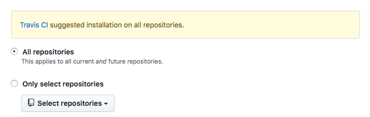

### Environment variables

The whole ci/cd pipeline needs credentials for some steps. These should not be publicly available for everyone, even not for every developer. Only the build server should have access to them.
The project needs the following environment variables:

**FILE_DECRYPTION_KEY**: The decryption key for the encrypted certificates and provisioning profiles in [./signing](signing).

**FASTLANE_USER**: Email address of an App Store Connect user to upload an _*.ipa_ to App Store Connect.

**FASTLANE_FASTLANE_PASSWORD**: Password of `FASTLANE_USER`.

**FASTLANE_DONT_STORE_PASSWORD**: Flag, that the user credentials should not save in the local keychain of the build server. Should always be 1.

**HOCKEYAPP_API_TOKEN**: API token to upload an _*.ipa_ to HockeyApp.

**CODECOV_TOKEN**: Codecov token for the connection to the Codecov project.

**DANGER_GITHUB_API_TOKEN** Personal access token of a GitHub Bot User account. With this one, the pull request comments will be made.

**GITHUB_ACCESS_TOKEN** Personal access token of a GitHub account, to not run in rate limits for anonymous user. These will happen for fetching pre-build Carthage frameworks.

In Travis CI you can set the environment variables in the _Settings_ of a project. These will be automatically injected into every new build.

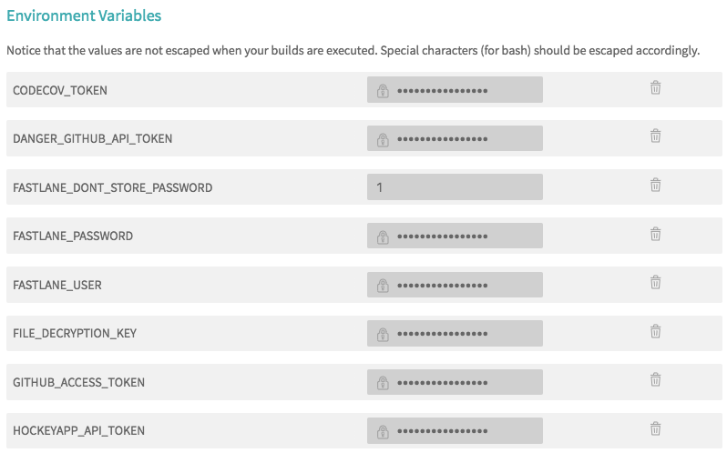

## Distribution

During the development of an app, there are different requirements for the distribution of an app. After you implemented a feature, at first the QA department and the product owner should test it. And only after approval, the version should be distributed to the internal tester. 
Then it should go to a public beta and the App Store release. 

To give the QA department and the product owner access to a pre-release app version, the app usually signed as Ad-hoc or In-House build. Instead of sending the _*.ipa_ through email or other ways, Apple supports distributing these versions over an own web server: [Distribute in-house apps from a web server](https://help.apple.com/deployment/ios/#/apda0e3426d7). 
Keep in mind to use this method only in a company-wide solution, and don't publish to the public.

### HockeyApp

[HockeyApp](https://hockeyapp.net) is a distribution and crash report service, which offers the web server space to download an Ad-hoc or In-House sign build via a website:

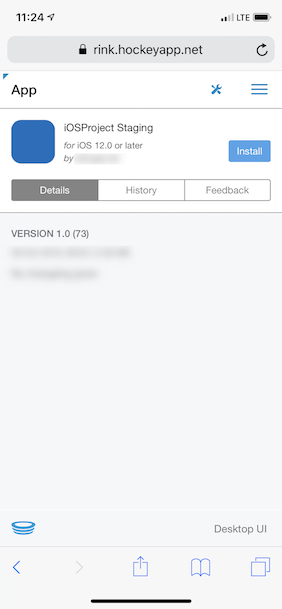

You only have to upload the _*.ipa_ to the service, and then you can share the link to your product owner.

#### Fastlane integration

Fastlane provides with [hockey](https://docs.fastlane.tools/actions/hockey/) a built-in function to upload an _*.ipa_ to the HockeyApp:

```
hockey(
  api_token: ENV['HOCKEYAPP_API_TOKEN'],
  ipa: lane_context[SharedValues::IPA_OUTPUT_PATH],
  dsym: lane_context[SharedValues::DSYM_OUTPUT_PATH]
)
```

You only have to provide an api token to a HockeyApp app. See [HockeyApp Account](#hockeyapp-account) how to create one.

### Testflight & App Store

For internal and public beta tests is Testflight from Apple the best way. Because you use an App Store signed build for it and need a review for the external beta test, you are very close to a release in the App Store.

For more information take a lot at the [Testflight](https://developer.apple.com/testflight/) section on Apple's developer site.

#### Fastlane integration

With [upload\_to\_testflight](https://docs.fastlane.tools/actions/upload_to_testflight/) fastlane also provides a function to upload an App Store signed _*.ipa_ to App Store Connect. It's used in the fastlane lane [release](./fastlane/Fastfile):

```
lane :release do
  build("../signing/release", "Release" ,"app-store")
  upload_to_testflight(skip_submission: true)
end
```

If you want manual submit your app to the public beta test set `skip_submission` to _true_.

To be able to upload an `*.ipa` to App Store Connect, fastlane needs user credentials for it. These will be set as environment variables (see [Environment variables](#environment-variables) section).
To create an App Store Connect user have a look at the [App Store Connect User](#app-store-connect-user) section.


## GitHub Integrations

Github offers a great web interface to work with multiple developers on a project. How you can organize your flow is for example described in [Understanding the GitHub flow](https://guides.github.com/introduction/flow/). Other flows and conventions are listed in my repository [messeb/development-conventions](https://github.com/messeb/development-conventions).

The most important part during development, (after writing the code), is the code review in your team. There you can review and discuss implemented solutions. Github provides with its pull request feature ([Creating a pull request](https://help.github.com/articles/creating-a-pull-request/)) a dedicated manner to do it.  But the review of code is one of the most challenging parts in software development. Besides the discussion about the main feature, there are always some stressful side discussions about code style, test coverage, and some missing pieces.

Therefore GitHub provides APIs for the integration of 3rd party service in their pull request. There is also a whole Marketplace for services which can improve the development workflow: [GitHub Marketplace](https://github.com/marketplace).

The project template uses Danger, HoundCI, and Codecov. With that integrations, you see common warnings and errors already in the pull request, and a reviewer will only check out and review the code when everything else is fine. Therefore it's essential that a ci build is done on any changes of a pull request. It should not be needed to check out a feature branch and build it locally to see that anything obvious is wrong.

### Danger

[Danger](https://danger.systems) is a tool that runs in the ci pipeline and can comment on pull requests if changes in the pull request violate predefined rules. It could look like this:

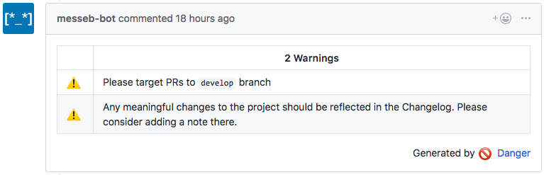

The rules a defined in the [Dangerfile](./Dangerfile) and it uses a GitHub bot user to create that comments ([Creating a bot account for Danger to use](https://danger.systems/guides/getting_started.html#creating-a-bot-account-for-danger-to-use)). But it also supports GitLab and Bitbucket Server. Take a look in the Danger [Getting set up](https://danger.systems/guides/getting_started.html) guide.

Danger is a big help to concentrate only on the critical parts of the code changes in a review. Because the creator of the pull request gets this warnings direct after a pull request ci build and these can be fixed before another developer have even a look at the code changes.

Of course, you have to define the rules for the Danger check, but you can add them one time after a discussion in the team, and the same debate will never occur.
Good starting points for fundamental rules are the [Danger Reference](https://danger.systems/reference.html) and a GitHub search for "Dangerfile" ([click](https://github.com/search?q=Dangerfile)).

The template uses the Ruby version ([Gemfile](Gemfile)) of Danger because you also define your fastlane lanes also in Ruby. Danger is executed through the [Makefile](Makefile) target _pull\_request_ on the build server.

### HoundCI

[HoundCI](https://houndci.com) is a 3rd party service which integrates into the GitHub pull request and checks the Swift source files against linting rules. 

It supports [SwiftLint](https://github.com/realm/SwiftLint), which is the defacto standard for linting Swift files.
If you don't use SwiftLint already, you should have a look at the [rules reference](https://github.com/realm/SwiftLint/blob/master/Rules.md) and see how great it is. After a team agreement, you will have much less discussion about the code style. Also, you can run it locally with your Xcode build, so that the warnings appear during development in Xcode:

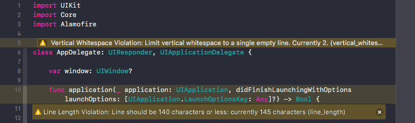

For the ci build HoundCI will comment inline in the pull request so you will see the linting error direct:

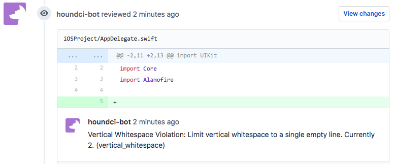

The configuration of HoundCI is done in the [.hound.yml](.hound.yml) and full documentation of it you will find [HoundCI SwitfLint](http://help.houndci.com/configuration/swiftlint) site.

### Codecov

Tests are essential as the feature code itself. But it's not easy to see if all code paths are covered. Codecov brings visualization of the code coverage in the current pull request:

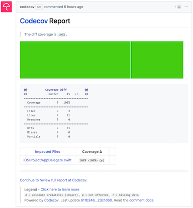

You will see what code paths are not covered by the tests in the current pull request code and how the code coverage is changed against the base branch.
It uses the code coverage output that `xcodebuild` produces. So you need to enable it in the scheme:

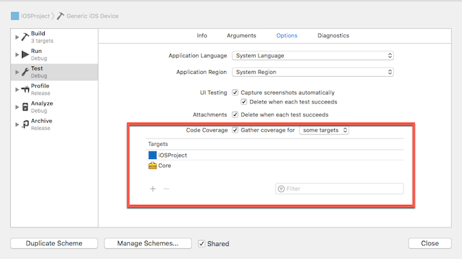

The configuration of Codecov will be done in the [.codecov.yml](.codecov.yml) file. You will find more information in the [Codecov Guide](https://docs.codecov.io/docs). The upload of the code coverage reports are done in the [Makefile](Makefile) target _codecov\_upload_.

## Usage

To use the template for your own project, you have to change some configurations and contents of files.

### Signing

Create the signing certificates and provisioning profiles for the different builds in the [Certificates, Identifiers & Profiles](https://developer.apple.com/account/ios/certificate/) section of the developer portal.

Add your unencrypted signing certificate and mobile provision profile for the `Staging` (Folder [signing/staging](signing/staging)) and `Release` (Folder [signing/release](signing/staging)) versions to their folders and delete other existing files.

Then call in the command line:

```
$ bundle install
$ bundle exec fastlane encrypt
```

You will be asked for an encryption key. After entering, the files will be encrypted with it. Remember the key, it will be set as environment variable `FILE_DECRYPTION_KEY` for the decryption on the build server.

### Configuration

To configure the project for your team and with your bundle identifiers and signing information you have to change only following `*.xcconfig` files.

**SharedSigning.xcconfig** ([SharedSigning.xcconfig](iOSProject/Configurations/Builds/Signing/SharedSigning.xcconfig)): Change the `DEVELOPMENT_TEAM` to your team id.

**DebugSigning.xcconfig** ([DebugSigning.xcconfig](iOSProject/Configurations/Builds/Signing/DebugSigning.xcconfig)): Change the `PRODUCT_BUNDLE_IDENTIFIER` to the bundle identifier for your local development.

**StagingSigning.xcconfig** ([StagingSigning.xcconfig](iOSProject/Configurations/Builds/Signing/StagingSigning.xcconfig)): Change the `PRODUCT_BUNDLE_IDENTIFIER` to the bundle identifier for your staging build. Also set `CODE_SIGN_IDENTITY` and `PROVISIONING_PROFILE_SPECIFIER` to the names of the signing identity and the mobile provisioning profile for the staging build.

**ReleaseSigning.xcconfig** ([ReleaseSigning.xcconfig](iOSProject/Configurations/Builds/Signing/ReleaseSigning.xcconfig)): Change the `PRODUCT_BUNDLE_IDENTIFIER` to the bundle identifier for your App Store build. Also, set `CODE_SIGN_IDENTITY` and `PROVISIONING_PROFILE_SPECIFIER` to the names of the signing identity and the mobile provisioning profile for the App Store build.

### HockeyApp Account

Create a free HockeyApp account on [https://hockeyapp.net/](https://hockeyapp.net/) and add a new iOS distribution app on the [Dashboard](https://rink.hockeyapp.net/manage/dashboard).

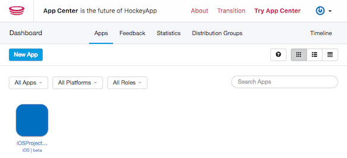

Generate an API Token for your created distribution app on the [Create API Token](https://rink.hockeyapp.net/manage/auth_tokens) page and set the environment variable `HOCKEYAPP_API_TOKEN` to that value.

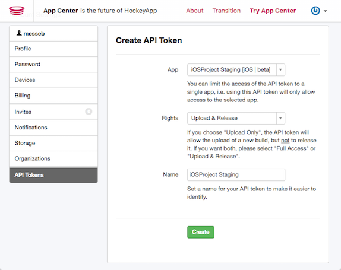

### App Store Connect User

To upload the app artifact for the App Store via fastlane, it needs credentials for an App Store Connect app.
Create a new App Store connect user in the [User and Access](https://appstoreconnect.apple.com/access/users) section for the usage with fastlane.

It should have the _Developer_ role and only access to the needed apps.

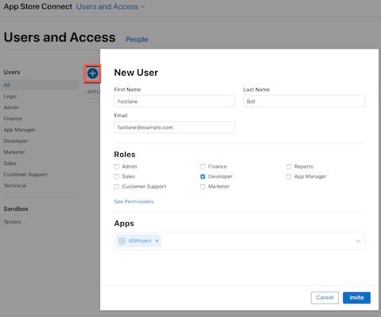

Set the environment variables `FASTLANE_USER` with the email address and `FASTLANE_PASSWORD` with the password of the App Store Connect user.

### GitHub

To use the GitHub integrations, you have to configure accounts and setup some service.

**Danger**: To use Danger, create a new GitHub Account like my bot ([messeb-bot](https://github.com/messeb-bot)), generate a personal token in the [Developer Settings](https://github.com/settings/tokens) and assign it to the environment variable `DANGER_GITHUB_API_TOKEN`

**HoundCI**: Go to the website [https://houndci.com](https://houndci.com) and log in with your GitHub Account. Then you can connect your repositories with HoundCI.

**Codecov**: To integrate Codecov in your visit the [Codecov Marketplace site](https://github.com/marketplace/codecov) and add it to your repository. On the Codecov site you can then access the *Settings* page of the repository. Set the value of **Repository Upload Token** to the environment variable `CODECOV_TOKEN`.

### Makefile

Uncomment in the [Makefile](Makefile) the target of the `staging` and `release` build to:

```
staging:
	bundle exec fastlane staging

release:
	bundle exec fastlane release
```